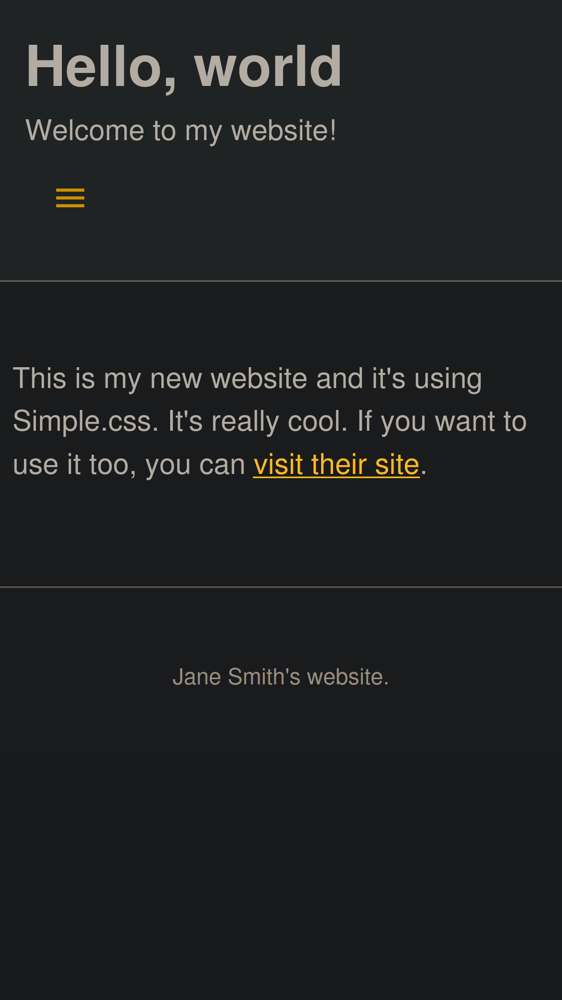

# Simple.css {}

Simple.css is a classless CSS template that allows you to make a good looking website really quickly.

**Find out more at [https://simplecss.org](https://simplecss.org).**

---
### Responsive and with dark mode:

## Supported Browsers

Any evergreen browser > IE11 (why is IE still a thing?)
